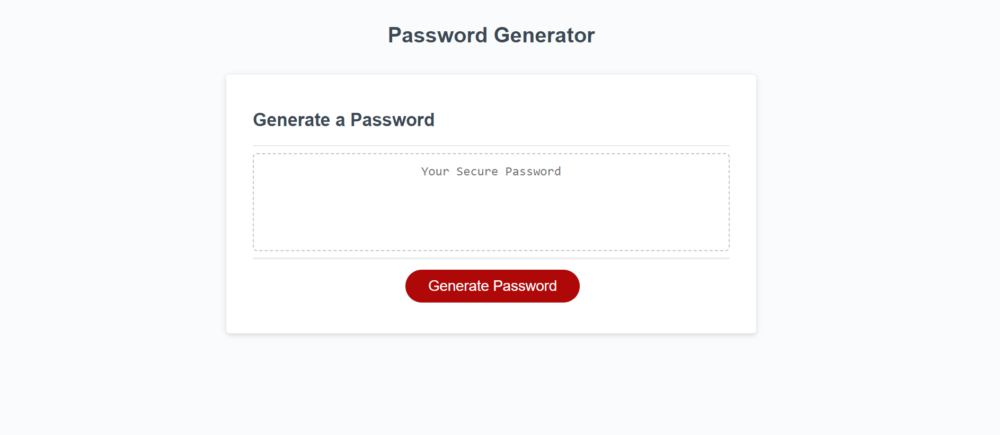

# Password Generator

## Overview

This application was designed to generate a random selection of characters from what the user selected. The user is asked what length of password they want and if they what characters they would like to include. If the user doesn't select any options the prompts will run again. When the user has selected what characters they want to include the password will then be generated.

## Screenshot

  

## Link to deployed site

https://jaycee808.github.io/passwordGenerator/